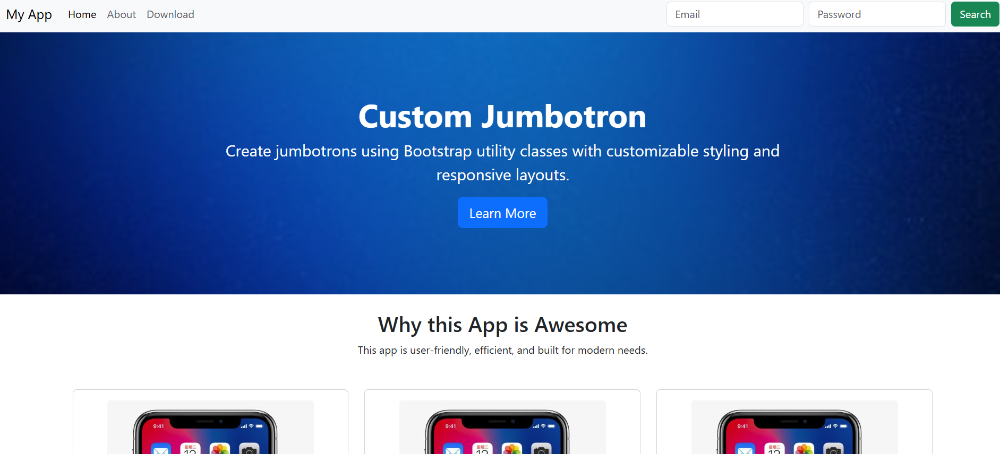

# 📱 Responsive Web App Landing Page

This is a **responsive landing page** built using **Bootstrap 5**. It features a navigation bar, a jumbotron section, a three-card layout showcasing features, and a footer with download information. Semantic HTML5 tags are used to enhance structure and accessibility.

---

## 🚀 Features

- ✅ **Responsive Navbar**  
  A collapsible Bootstrap navigation bar that becomes a hamburger menu on smaller screens.

- 🎯 **Jumbotron Section**  
  A prominent hero area (jumbotron) with a background image and a CTA button.

- 🧩 **Three-Card Feature Grid**  
  A Bootstrap grid layout presenting three core features of the app in individual cards.

- 📥 **Footer**  
  A footer with download information and app store icon.

- 🧱 **Semantic HTML Tags**  
  Utilizes `header`, `main`, `section`, `article`, and `footer` tags for clean structure.

---

## 🖼️ Preview

  
<sub>*Include a screenshot of your project in action here*</sub>

---

## 📁 Project Structure

project/
├── index.html
├── blue.jpg # Background image for jumbotron
├── card.jpg # Placeholder image for cards
├── appstore.png # App store badge
└── README.md

---

## 🛠️ Built With

- [Bootstrap 5.3](https://getbootstrap.com/)
- HTML5 & CSS3

---

## 🧑‍💻 How to Use

1. Clone the repository  
   ```bash
   git clone https://github.com/your-username/your-repo-name.git

2. Open index.html in your browser
